<div align="center">


# PERi-PHRASE

### #SayMo. Hear Mo. Understand Mo.

**Commercial Practice — Stream 1**  
**iPendoring 2026 #SayMo Campaign Response**

**Nando's × PERi-PHRASE**

<br>

<!-- REPLACE THIS PATH IF YOUR FINAL BANNER HAS A DIFFERENT NAME OR LOCATION -->


<br>


</div>

---

# Overview

**PERi-PHRASE** is an interactive two-player language experience created as a cross-disciplinary response to the **iPendoring 2026 #SayMo brief**.

Developed for **Nando's**, the experience celebrates South Africa's linguistic diversity through play, pronunciation, listening, interpretation and, inevitably, a little bit of misunderstanding.

Two players are challenged to communicate South African phrases across languages.

One player becomes the **Reader**, receiving a phrase that they must read aloud as accurately as possible.

The second player becomes the **Guesser**, who listens to their teammate and attempts to identify the meaning of the phrase by selecting the correct illustration from a visual grid.

The experience transforms the awkwardness, humour and unpredictability of speaking an unfamiliar South African language into a collaborative game.

Rather than treating South Africa's languages as something that simply needs to be preserved, PERi-PHRASE encourages players to actively engage with them.

The result is a playful interpretation of **#SayMo**:

**Say more. Hear more. Learn more.**

---

# The Brief

PERi-PHRASE was developed for the **Commercial Practice Theme 3 project** as part of **Stream 1: All Students Except Game Design & 3D**.

The Stream 1 brief challenged cross-disciplinary groups to conceptualise a response to the **Pendoring Award 2026 theme, #SayMo**, while aligning the response with a South African brand.

The brief positions South Africa's language and cultural diversity as a competitive advantage for the country's future.

Rather than only celebrating what South Africa already is, the challenge asks creatives to consider what the country can become when its languages, cultures and perspectives are allowed to thrive together.

The final response was also required to meaningfully integrate the disciplines of every member of the group.

PERi-PHRASE responds to this challenge through an interactive Nando's experience centred around South African language, communication and shared participation.

---

# Stream 1

This project was completed as part of:

**Stream 1 — All Students Except Game Design & 3D**

The Stream 1 challenge asks:

> How do we transform the Pendoring theme "#SayMo" into a message that genuinely excites people about South Africa's future potential?

The project's core communication focuses on the idea that South Africa does not simply preserve its languages and cultures — it amplifies them.

PERi-PHRASE interprets this idea through interaction.

Instead of asking users to passively read about linguistic diversity, the experience asks them to **speak, listen, interpret and participate in it**.

---

# Project Information

| Item | Details |
|---|---|
| **Project Name** | PERi-PHRASE |
| **Project Type** | Interactive Campaign Experience |
| **Brief** | Commercial Practice — Theme 3 |
| **Stream** | Stream 1 |
| **Campaign** | iPendoring 2026 |
| **Theme** | #SayMo |
| **Selected Brand** | Nando's |
| **Platform** | Large-format Interactive Display |
| **Target Resolution** | 2560 × 1600 px |
| **Development Framework** | React Native / Expo |
| **Language** | TypeScript |
| **Primary Interaction** | Two-player language game |
| **Implemented Languages** | Afrikaans & isiZulu |

---

# Project Resources

The following resources document the design, development and collaborative process behind PERi-PHRASE.

### GitHub Repository

The complete source code for the interactive experience is available here:

[PERi-PHRASE GitHub Repository](https://github.com/inesmith/PERi-PHRASE)

### Figma

The interface design, visual layouts and UI/UX development can be viewed in the project Figma file:

[View PERi-PHRASE in Figma](https://www.figma.com/design/BQiTCzLUf3ybneF1KOeC34/Eline-Gharbarmith?node-id=262-880&t=qpEiT0CFSEMrbKnD-1)

### Miro

The collaborative planning, ideation and development process can be viewed on the project Miro board:

[View the PERi-PHRASE Miro Board](https://miro.com/app/live-embed/uXjVH-q-jd8=/?embedMode=view_only_without_ui&moveToViewport=-5248%2C-3953%2C39250%2C24055&embedId=945667795541)

---

# Team

PERi-PHRASE was developed as a **cross-disciplinary team project**.

The final experience combines Interactive Development, Communication Design, Illustration, UI/UX and Motion Design.

| Team Member | Discipline | Contribution |
|---|---|---|
| **Iné Smith** | Interactive Development | Application development, game logic, interaction systems, multiplayer flow, screen implementation, technical integration and voucher functionality |
| **Lila Barnes** | Communication Design / Illustration / UI & UX | Visual identity, illustration, interface design, user experience and visual assets |
| **Elie Gharzo** | Motion Design | Motion design, animation and movement-based visual elements |

The project was built collaboratively, with each discipline contributing to the final campaign experience rather than functioning as separate outputs.

---

# Brand — Nando's

Nando's was selected as the South African brand for PERi-PHRASE.

Nando's provides a particularly strong context for the project because its identity is closely connected to South African humour, personality, cultural references and communication.

PERi-PHRASE extends this playful communication style into language.

Mispronunciations, unexpected interpretations and communication between players become part of the experience rather than something players are punished for.

The project therefore uses language learning less like a classroom exercise and more like a social Nando's interaction:

**playful, slightly chaotic and distinctly South African.**

---

# The Concept

South Africa is one of the most linguistically diverse countries in the world.

However, people can live alongside multiple South African languages without necessarily interacting with or understanding them.

PERi-PHRASE turns that communication gap into the game itself.

Instead of presenting users with translations and asking them to memorise vocabulary, players must rely on one another.

The Reader has access to the phrase.

The Guesser has access to the possible meanings.

Neither player can complete the challenge alone.

**The communication between them becomes the interface.**

---

# Key Message

PERi-PHRASE is built around a simple idea:

### You don't need to speak a language perfectly to start speaking it.

The experience encourages players to try unfamiliar words, listen to one another and laugh at the inevitable mistakes along the way.

Through this interaction, language becomes something social rather than intimidating.

The project interprets **#SayMo** as an invitation to:

- Say more.
- Hear more.
- Try more.
- Understand more.
- Engage with more South African languages.
- Connect with more South Africans.

---

# Languages

PERi-PHRASE was conceptualised around South Africa's multilingual landscape and has the potential to expand across the country's spoken official languages.

The broader concept can therefore accommodate:

- Afrikaans
- English
- isiNdebele
- isiXhosa
- isiZulu
- Sepedi
- Sesotho
- Setswana
- siSwati
- Tshivenda
- Xitsonga

South African Sign Language is not currently part of the PERi-PHRASE concept.

For the developed prototype, the two fully implemented language experiences are:

### Afrikaans

and

### isiZulu

These two languages form the playable language exchange currently included in the application.

The project architecture and concept allow additional South African languages to be incorporated in future iterations.

---

# How PERi-PHRASE Works

PERi-PHRASE is designed as a **two-player cooperative language experience**.

The players take on two different roles.

### The Reader

The Reader receives a phrase in the selected language.

Their task is to:

1. Read the phrase.
2. Attempt to pronounce it correctly.
3. Say it out loud to their teammate.
4. Help the Guesser identify what the phrase means.

### The Guesser

The Guesser does not receive the phrase in the same way.

Instead, they are presented with a grid of illustrations representing possible meanings.

Their task is to:

1. Listen carefully to the Reader.
2. Interpret what they hear.
3. Compare it with the available illustrations.
4. Select the illustration they believe matches the phrase.

Communication between the two players is therefore essential.

---

# Two-Screen Experience

PERi-PHRASE is designed to operate across **two separate screens**.

Both screens run the same application but present different information according to the role assigned to each player.

During gameplay, one screen displays the **Reader experience**, while the other displays the **Guesser experience**.

Conceptually:

```text
SCREEN 1                         SCREEN 2
   │                                │
   ↓                                ↓
Player / Role                  Player / Role
   │                                │
   ↓                                ↓
Reader                         Guesser
   │                                │
Phrase                           Grid
   │                                │
   └──────── Communication ─────────┘
                    ↓
               Round Result
```

The two displays work together as one shared experience.

The application uses **Firebase / Cloud Firestore** to maintain shared game state between the two running instances.

Each screen also stores local screen/player information where required, which is why the two screens should be opened in separate browser contexts during development.

---

# Game Flow

```text
Start Screen
      ↓
Begin Experience
      ↓
Player Connection
      ↓
QR / Join Interaction
      ↓
Language Selection
      ↓
Game Begins
      ↓
Roles Assigned
      ↓
 ┌───────────────────────────────┐
 │                               │
 ↓                               ↓
Reader Screen               Guesser Screen
 │                               │
 ↓                               ↓
Phrase Displayed           Illustration Grid
 │                               │
 ↓                               ↓
Reads Phrase Aloud         Listens to Reader
 │                               │
 └───────────────┬───────────────┘
                 ↓
           Guesser Selects
                 ↓
          Answer Evaluation
                 ↓
       Correct / Incorrect
           / Timeout
                 ↓
            Next Round
                 ↓
       Roles / Phrase Update
                 ↓
         Continue Playing
                 ↓
         Game Completion
                 ↓
        Win / No-Win Outcome
                 ↓
       ┌─────────┴─────────┐
       │                   │
      WIN                NO WIN
       │                   │
       ↓                   ↓
Champion Screen      No Voucher Unlocked
       │                   │
       ↓                   ↓
Reward / Voucher     Automatic Reset
       │                   │
       ↓                   │
Enter Email Address        │
       │                   │
       ↓                   │
Voucher Sent               │
       │                   │
       └─────────┬─────────┘
                 ↓
       Return to Start Screen
```

---

# Gameplay

Each game consists of a series of timed rounds.

During a round, the Reader and Guesser receive different information.

The Reader sees the phrase that needs to be communicated.

The Guesser sees a selection of illustrations.

The Reader must communicate the phrase verbally while the Guesser attempts to determine which illustration represents the correct meaning.

A countdown timer creates urgency and prevents players from spending too long on a single phrase.

---

# Reader Screen

The Reader screen displays:

- Current round
- Countdown timer
- Reader instructions
- Phrase artwork
- Language-specific phrase
- Round result feedback

The Reader is instructed to:

**Read this phrase out loud as best you can!**

The phrase is intentionally presented without giving the Reader a complete explanation of how their teammate will interpret it.

This keeps the interaction focused on communication.

---

# Guesser Screen

The Guesser screen focuses almost entirely on the illustration grid.

The Guesser receives:

- Countdown timer
- Nine possible illustrations
- Interactive selection
- Result feedback

The round number is intentionally omitted from the Guesser grid so that the visual hierarchy remains focused on the available answers and countdown timer.

The timer is positioned towards the upper area of the display to maximise the available space for the illustration grid.

---

# Round Results

Each round can end in one of three states.

### Correct

The Guesser selected the correct illustration.

The experience celebrates the successful communication between the two players.

### Incorrect

The Guesser selected an incorrect illustration.

The correct meaning is then revealed.

### Timeout

The countdown reaches zero before a selection is completed.

The players are shown the phrase and correct illustration before continuing.

---

# Role-Based Feedback

The Reader and Guesser receive different feedback after each round.

### Reader

The Reader is shown what they communicated to their teammate, along with the corresponding visual interpretation.

### Guesser

The Guesser receives result-specific feedback and is shown the correct illustration and phrase.

This allows both players to understand the relationship between:

**what was written → what was spoken → what was heard → what it meant.**

---

# Game Completion

At the end of the game, the final outcome depends on the players' performance.

If the required result has been achieved, the players reach the **Champion** and voucher flow.

If the required result has not been achieved, the experience does not continue to a traditional results page or voucher screen.

Instead, the players receive the message:

### The heat got you this time — no voucher unlocked.

The no-win screen remains visible briefly before the experience automatically returns to the starting screen.

There is no manual replay button because the intended activation is based around a once-off participation flow.

---

# The Reward

Players who successfully complete the required game outcome unlock the reward flow.

The reward connects the digital experience back to the physical Nando's environment.

The player can request a digital voucher, which can then be shown at the order desk to collect the associated sticker pack.

This gives the interactive campaign a physical endpoint rather than allowing the experience to end entirely on-screen.

---

# Voucher Email System

The voucher email functionality is implemented and functional.

After successfully completing the experience:

1. The user reaches the Champion / reward screen.
2. The user selects the voucher action.
3. The user is taken directly to the Email Voucher screen.
4. The user enters their email address.
5. The application validates the input.
6. Once a valid email has been entered, the **Send Voucher** button becomes available.
7. The voucher is sent to the supplied email address.
8. The user is taken to the **Voucher Sent** screen.
9. After a short delay, the application automatically returns to the starting screen.

The user does not need to manually exit the final confirmation screen.

Voucher printing is **not implemented** in the final flow. The reward is delivered digitally through email.

---

# Email Validation

The voucher interface is intentionally designed so that the Send Voucher button is not displayed until a valid email address has been entered.

Instead of displaying an inactive button with reduced opacity, the interface keeps the action hidden until it becomes relevant.

The email input itself is functional, while a custom illustrated input frame is used as part of the visual interface.

This creates a cleaner interaction and prevents users from attempting to submit incomplete information.

---

# QR Interaction

The project includes a QR-style joining interaction as part of the intended player connection experience.

For the current prototype, **live QR scanning is not implemented**.

The interaction is visually represented in the application to demonstrate the intended user journey, while a button is used to progress through the prototype.

This allows the experience to communicate how the final QR-based interaction would function without presenting the prototype implementation as a fully operational QR scanning system.

---

# Target Display

PERi-PHRASE was designed specifically for a large-format display.

### Target Resolution

```text
2560 × 1600 px
```

The interface, illustrations, typography and positioning were developed around this target resolution.

For the closest representation of the intended experience, **both player screens should be viewed at 2560 × 1600 px**.

Running the application at significantly different aspect ratios or resolutions may cause differences in:

- Image positioning
- Illustration spacing
- Typography scale
- Button placement
- Decorative elements
- Background cropping
- Grid alignment

The target display should therefore be used when presenting or assessing the final experience.

---

# Asset Loading

PERi-PHRASE makes extensive use of custom visual assets, including:

- Full-screen backgrounds
- Illustrated answer cards
- Phrase artwork
- Buttons
- Logos
- Decorative elements
- Result graphics
- Interface frames

Because the experience is highly visual, image loading can affect the perceived smoothness of screen transitions.

Important assets are preloaded where possible so that backgrounds, illustrations and buttons are available before the user reaches their respective screens.

This is especially important for:

- Game backgrounds
- Phrase graphics
- Illustration grids
- Result screens
- Buttons
- Champion screen assets
- Voucher screens

The application preloads important assets during its initial setup before allowing the main experience to render.

This reduces the delay where a screen could otherwise appear before its illustrations or interface graphics have finished loading.

---

# Loading the Experience

When PERi-PHRASE first starts, the application may require a moment to prepare its visual assets and connect to the shared game session.

For the intended installation experience, allow the application to complete its initial loading process before beginning gameplay.

This helps ensure that transitions between screens feel immediate and prevents visual elements from appearing after the rest of a screen has already rendered.

Both browser instances should be fully loaded before starting a new game.

---

# Technology Stack

| Technology | Purpose |
|---|---|
| **React Native** | Interactive application development |
| **Expo** | Development environment and web runtime |
| **TypeScript** | Type-safe application logic |
| **Firebase / Cloud Firestore** | Shared game state and synchronisation between the two screens |
| **AsyncStorage** | Local persistence for player role and screen identity |
| **Expo Asset** | Preloading important visual assets |
| **React Hooks** | State and lifecycle management |
| **ImageBackground** | Full-screen visual environments |
| **React Native Image** | Interface and illustration assets |
| **Pressable** | Interactive buttons and game selections |
| **TextInput** | Voucher email input |
| **Custom Fonts** | Campaign typography and visual identity |
| **Email Service / Backend Integration** | Voucher delivery |

---

# Technical Features

The prototype includes:

- Two-player game flow
- Two-screen experience
- Persistent screen identity
- Player role assignment
- Reader and Guesser roles
- Shared Firestore game state
- Real-time screen synchronisation
- Language selection
- Afrikaans phrase set
- isiZulu phrase set
- Timed rounds
- Dynamic phrase loading
- Illustration-based guessing
- Correct answer detection
- Incorrect answer handling
- Timeout handling
- Round progression
- Role-specific interfaces
- Role-specific result screens
- Custom illustration positioning
- Custom background artwork
- Image-based UI elements
- Champion / completion flow
- No-win flow
- Reward flow
- Email input
- Email validation
- Voucher delivery
- Automatic return to start
- Asset preloading
- Local role persistence
- Automatic game reset

---

# Installation

## Prerequisites

Before running PERi-PHRASE, ensure that the following are installed:

- Node.js
- npm
- Git
- Visual Studio Code or another code editor
- Expo development tooling
- A supported modern browser

Check that Node.js and npm are available:

```bash
node --version
npm --version
```

---

# Clone the Repository

Clone the PERi-PHRASE repository:

```bash
git clone https://github.com/inesmith/PERi-PHRASE.git
```

Navigate into the project:

```bash
cd PERi-PHRASE
```

---

# Install Dependencies

Once inside the project folder, install all required packages:

```bash
npm install
```

Wait for installation to complete before starting the application.

If dependencies have already been installed but the project is behaving unexpectedly, they can be reinstalled.

On macOS or Linux:

```bash
rm -rf node_modules
npm install
```

On Windows, delete the `node_modules` folder manually or use the appropriate Windows command, then run:

```bash
npm install
```

---

# Service Configuration

PERi-PHRASE uses external services for features such as:

- Shared game state
- Two-screen synchronisation
- Voucher email delivery

The application therefore requires the relevant Firebase and email-service configuration used by the project.

Private API keys, service credentials and secrets should **never be committed to the public repository**.

If an `.env.example` file is included in the repository, create a local `.env` file from it and supply the required values.

Before testing the complete experience, confirm that:

- Firebase is configured.
- Cloud Firestore is available.
- The application can access the shared game session.
- The voucher email service is configured.
- Any required environment variables are available.
- Internet connectivity is available.

---

# Start the Project

Run:

```bash
npx expo start
```

Expo will start the development server.

To launch the web version directly, use:

```bash
npx expo start --web
```

Alternatively, after running:

```bash
npx expo start
```

press:

```text
w
```

inside the Expo terminal.

Expo will provide the local address used to access the application.

The exact address or port may differ depending on the development environment.

---

# Opening the Two Screens

PERi-PHRASE is designed as a **two-screen experience**.

This means that two independent instances of the application need to be open at the same time.

Both instances connect to the same shared game session, but each screen maintains its own local identity.

> **Important:** Do not open both player screens as two ordinary tabs inside the same browser profile. PERi-PHRASE stores local screen and player information, so the two instances should use separate browser storage contexts.

After starting Expo, use the local URL provided in the terminal.

For example:

```text
http://localhost:8081
```

> The exact port may differ. Always use the URL displayed by Expo in the terminal.

---

## Screen 1

Open the Expo URL in your normal browser window.

For example:

```text
Chrome Normal Window
        ↓
      Screen 1
```

Leave this window open.

---

## Screen 2

Open the **same Expo URL** in a separate browser context.

Recommended options include:

- Chrome Incognito / Private window
- A different browser
- A separate browser profile
- A second computer, where supported by the development setup

For example:

```text
Chrome Normal Window
        ↓
      Screen 1

Chrome Incognito Window
        ↓
      Screen 2
```

Alternatively:

```text
Google Chrome
      ↓
   Screen 1

Safari / Firefox
      ↓
   Screen 2
```

Using separate browser contexts prevents the locally stored screen identity from being shared between both displays.

---

# Quickest Two-Screen Development Setup

For the easiest local setup:

### 1. Open the project in VS Code

Navigate to the PERi-PHRASE project folder.

### 2. Install the dependencies

If this is the first time the project is being opened on the computer:

```bash
npm install
```

### 3. Start Expo Web

Run:

```bash
npx expo start --web
```

### 4. Copy the local application URL

Expo will display the local URL being used by the application.

For example:

```text
http://localhost:8081
```

Use the address actually displayed by Expo.

### 5. Open Screen 1

Open the application URL in a normal Chrome window.

```text
Chrome
   ↓
Screen 1
```

### 6. Open Screen 2

Open a Chrome Incognito window.

Paste the **exact same application URL** into the Incognito window.

```text
Chrome Incognito
       ↓
    Screen 2
```

### 7. Keep both windows open

Do not close either browser instance during the game.

The two screens communicate through the shared game session.

### 8. Confirm both screens are responding

Both displays should initially show the starting experience.

When the first player progresses, the second screen should remain connected and respond according to the shared session state.

### 9. Begin the two-player experience

Progress through the simulated QR / receipt interaction on both displays.

Once both players have joined, the experience continues into the shared instructions, language selection and gameplay flow.

---

# Why Two Normal Tabs Should Not Be Used

The application uses local storage to maintain information such as:

- Screen identity
- Player role

If two ordinary tabs are opened inside the same browser profile, they may share this local information.

This can cause both tabs to behave as though they are the same screen or player.

For reliable testing, use:

```text
Chrome Normal + Chrome Incognito
```

or:

```text
Chrome + Safari
```

or another equivalent pair of separate browser contexts.

---

# Screen Identity

Each running instance of PERi-PHRASE is assigned a screen identity:

```text
screen1
```

or:

```text
screen2
```

The application stores this screen identity locally so that refreshing the application does not unnecessarily change which physical display is being used.

This allows each display to maintain its intended place within the two-screen experience.

Player roles are also stored locally where required so that development refreshes do not immediately remove the current player's role.

---

# Recommended Two-Screen Presentation Setup

The intended installation uses two large-format displays.

Recommended setup:

```text
DISPLAY 1                         DISPLAY 2
2560 × 1600                      2560 × 1600
     │                                │
     ↓                                ↓
Browser Instance 1               Browser Instance 2
     │                                │
     └──────── Shared Game ───────────┘
```

Before beginning the experience:

1. Connect the required displays.
2. Set each display to **2560 × 1600 px** where supported.
3. Open the project.
4. Start the Expo development server.
5. Open the first application instance in the first browser context.
6. Open the second application instance in a separate browser context.
7. Confirm that both screens are connected to the same shared game experience.
8. Use fullscreen mode where appropriate.
9. Allow all assets to finish loading.
10. Return both displays to the beginning of the experience.
11. Begin the participant journey.

Avoid changing browser zoom during the experience unless required for the specific presentation environment.

---

# Testing the Experience

Before presenting PERi-PHRASE, test the complete journey on **both screens**.

```text
Start
↓
Join
↓
Both Players Connected
↓
Instructions
↓
Language Selection
↓
Reader / Guesser Assignment
↓
Round 1
↓
Result
↓
Next Round
↓
Remaining Rounds
↓
Completion
↓
Win / No Win
↓
Voucher Flow (if unlocked)
↓
Voucher Sent
↓
Automatic Reset
↓
Start
```

The Reader and Guesser receive different interfaces, so testing only one screen does not verify the complete experience.

Test:

- Screen 1 joining
- Screen 2 joining
- Both players becoming connected
- Instructions
- Language selection
- Reader role
- Guesser role
- Correct selections
- Incorrect selections
- Timeout behaviour
- Reader feedback
- Guesser feedback
- Round progression
- Final game outcome
- Voucher email validation
- Voucher delivery
- Automatic reset
- Synchronisation between both screens

---

# Application Mockups

> Replace any image filename below if your final exported mockup has a different name or location.

## Campaign / Hero


---

## Start Screen

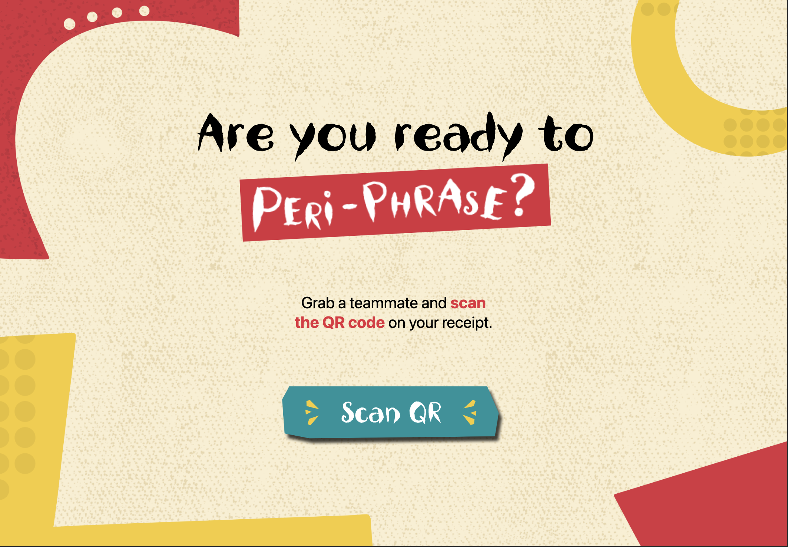

---

## Instructions Screen

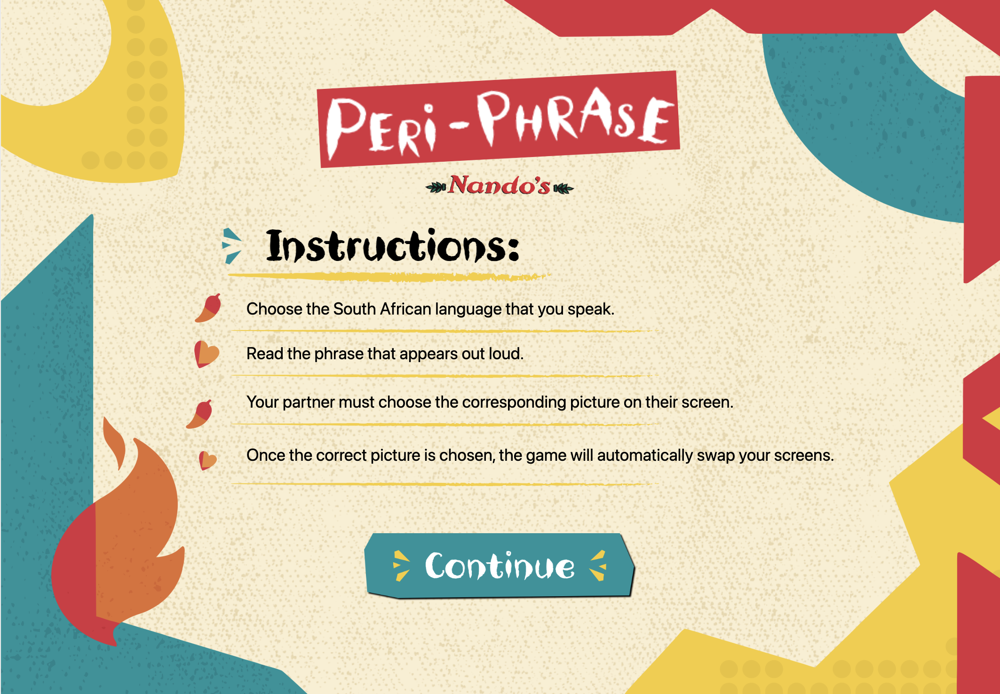

---

## Language Selection

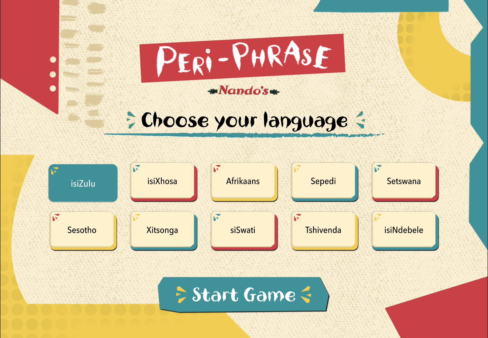

---

## Reader Screen

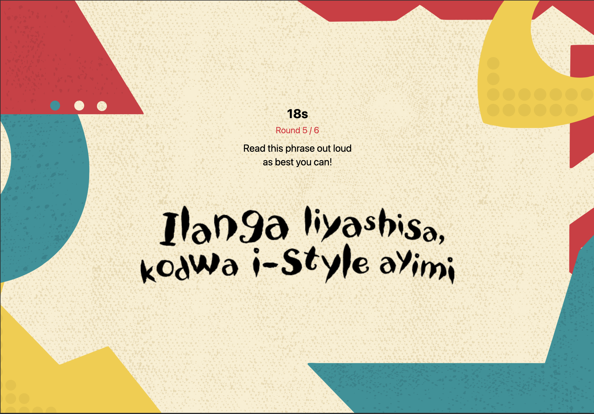

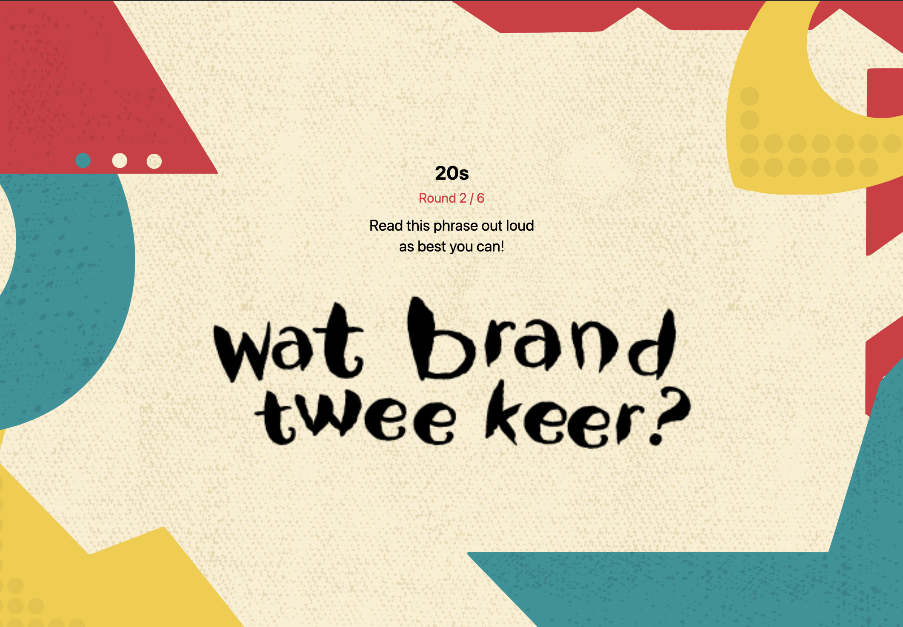

---

## Guesser Screen

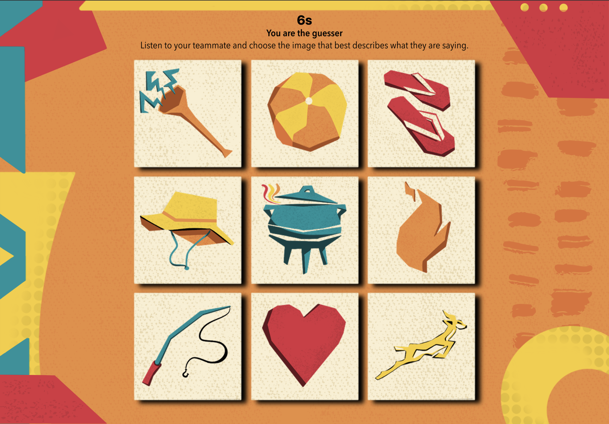

---

## Correct Result

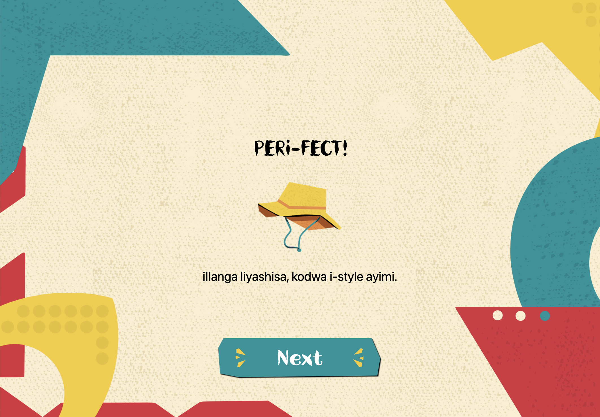

---

## Incorrect Result

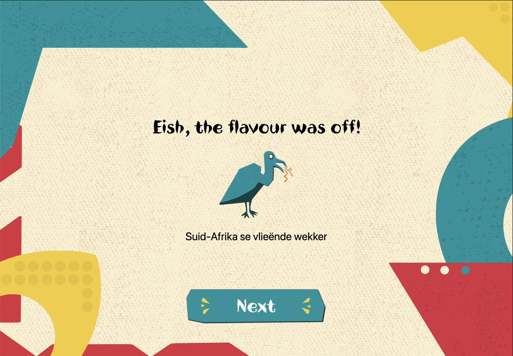

---

## Timeout Result

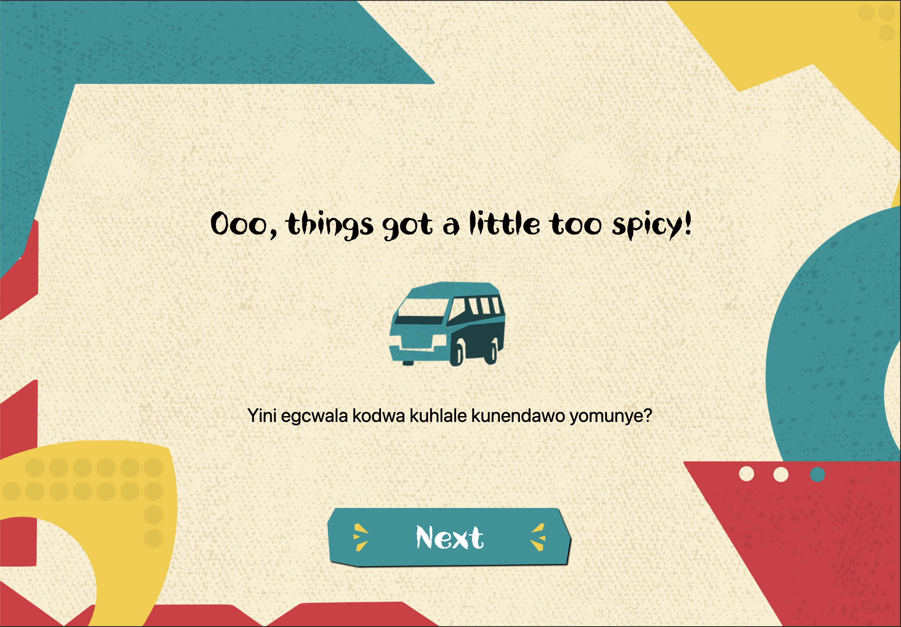

---

## Reveal Screen

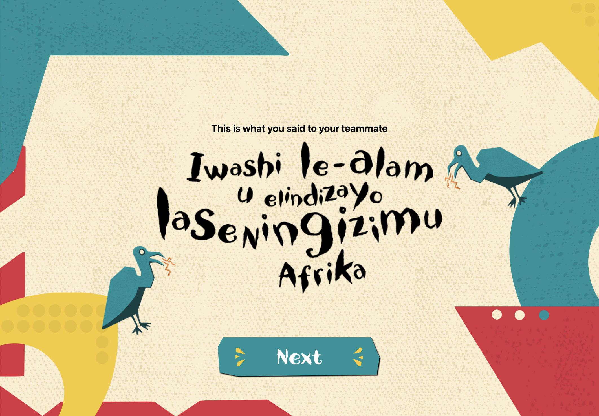

---

## Champion Screen

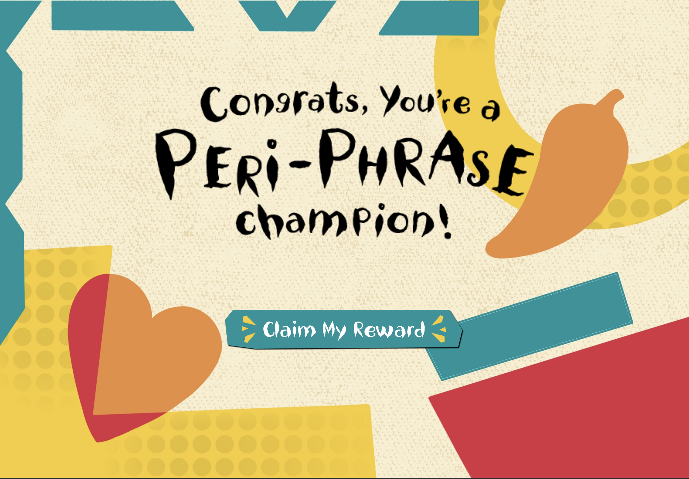

---

## Email Voucher Screen


---

# Project Structure

The exact structure may change as the project develops, but the application follows a structure similar to:

```text
PERi-PHRASE
│
├── src
│   │
│   ├── assets
│   │   │
│   │   ├── background
│   │   │   ├── champion.png
│   │   │   ├── complete-background.png
│   │   │   ├── grid-background.png
│   │   │   ├── reader-background.png
│   │   │   └── voucher-background.png
│   │   │
│   │   ├── buttons
│   │   │   ├── next.png
│   │   │   ├── send.png
│   │   │   └── ...
│   │   │
│   │   ├── phrases
│   │   │   ├── afrikaans
│   │   │   ├── zulu
│   │   │   └── logo
│   │   │
│   │   └── fonts
│   │
│   ├── components
│   │   └── input.png
│   │
│   ├── data
│   │   └── gameRounds.ts
│   │
│   ├── screens
│   │   ├── OrderScreen.tsx
│   │   ├── InstructionsScreen.tsx
│   │   ├── LanguageSelectionScreen.tsx
│   │   ├── GameScreen.tsx
│   │   ├── ResultsScreen.tsx
│   │   ├── FailedResultsScreen.tsx
│   │   ├── EmailVoucherScreen.tsx
│   │   ├── VoucherSentScreen.tsx
│   │   └── ...
│   │
│   ├── services
│   │   ├── gameSessionService.ts
│   │   └── voucherService.ts
│   │
│   └── types
│       ├── PlayerRole.ts
│       └── GameSession.ts
│
├── App.tsx
├── package.json
├── tsconfig.json
└── README.md
```

---

# Game Data

Round information is separated from the main game interface.

The game data defines information such as:

- Round ID
- Language
- Phrase
- Phrase image
- Available illustrations
- Correct illustration
- Language-specific assets

This allows the interface to remain reusable while the content changes between rounds.

It also makes future expansion into additional languages significantly easier.

---

# Shared Game Session

PERi-PHRASE uses a shared game session to coordinate the two running displays.

The shared session contains information required by both players, including aspects such as:

- Connected players
- Receipt / join state
- Player start state
- Selected languages
- Current Reader
- Current Guesser
- Current round
- Round result
- Game progress
- Correct rounds
- Final game state

Both application instances subscribe to the same session so that changes made by one player can be reflected on the other display.

This shared state is what allows the Reader and Guesser interfaces to behave as two parts of the same game.

---

# Visual Interface

A large portion of the PERi-PHRASE interface is image-driven rather than constructed entirely from standard interface components.

This approach allows the digital experience to remain visually consistent with the campaign's illustration and communication design.

Custom assets are used for:

- Phrase graphics
- Buttons
- Input frames
- Logos
- Illustrations
- Decorative elements
- Backgrounds
- Result graphics

Interactive React Native elements are positioned over or around these assets to preserve functionality.

For example, the email field uses a custom illustrated frame while the functional `TextInput` is placed over the visual asset.

---

# Interaction Design

The interface was intentionally designed to reduce unnecessary UI elements.

Examples include:

- Removing unnecessary back buttons from the voucher flow.
- Only showing the voucher send button once a valid email is available.
- Automatically returning to the starting screen after voucher completion.
- Automatically resetting the no-win experience.
- Keeping the Guesser screen focused on the timer and illustrations.
- Giving the Reader and Guesser only the information relevant to their role.
- Using visual buttons rather than generic system buttons.
- Removing voucher printing from the final intended flow.

This helps the application behave more like an interactive campaign installation than a conventional application.

---

# Automatic Reset

PERi-PHRASE is intended to support repeated participation in a public-facing environment.

The application automatically returns to the start after either:

- The completed voucher flow, or
- The no-win outcome.

After a voucher has successfully been sent, the confirmation screen remains visible briefly before returning to the beginning.

Likewise, if the players do not unlock the voucher, the no-win message remains visible briefly before the experience resets.

This means the previous participants do not need to manually prepare the application for the next group.

The reset also clears the previous player role information required for a fresh game while maintaining the screen identity of each display.

---

# Troubleshooting

## Images appear after the screen has already loaded

This usually means the visual assets have not yet been cached or preloaded.

PERi-PHRASE preloads important assets during startup, but allow the application to complete its initial loading process before beginning the full experience.

If necessary during development, reload the application after the first asset load.

---

## Dependencies are missing

Run:

```bash
npm install
```

Then restart Expo.

---

## Expo cache problems

Try:

```bash
npx expo start --clear
```

This clears the development cache and restarts the project.

---

## The layout looks incorrect

Check the display resolution.

The project was designed around:

```text
2560 × 1600
```

Different display sizes and aspect ratios can change the positioning of fixed-size visual assets.

Also check that browser zoom has not been changed unexpectedly.

For the intended presentation, both displays should be configured as closely as possible to the target resolution.

---

## Both windows behave like the same screen

This usually means both application instances are sharing the same browser storage.

Do not use two normal tabs in the same browser profile.

Instead, try:

```text
Chrome Normal + Chrome Incognito
```

or:

```text
Chrome + Safari
```

or another combination of separate browser contexts.

Refresh both instances after separating them if necessary.

---

## Screen 1 works but Screen 2 does not respond

First confirm that both browser instances are still running.

Then check that:

- Both screens are using the same running Expo application.
- Both screens have internet access.
- Both screens are connected to Firebase / Firestore.
- Screen 1 and Screen 2 are running in separate browser contexts.
- Both screens have completed their initial loading process.
- The shared game session has not been left in an old or incomplete state.

If the issue continues during development:

1. Close both browser instances.
2. Stop Expo.
3. Restart Expo using:

```bash
npx expo start --clear
```

4. Open Screen 1 in a normal browser window.
5. Open Screen 2 in an Incognito / Private window or another browser.
6. Reload both screens.
7. Begin the experience again from the start.

---

## The second player cannot join

Make sure the first browser instance and second browser instance are not sharing the same local browser storage.

The application assigns player roles and screen identities during the joining process.

Using two ordinary tabs can therefore interfere with player assignment.

Use:

```text
Screen 1 = Chrome Normal

Screen 2 = Chrome Incognito
```

and retry the joining flow.

---

## A screen keeps its old role after refreshing

PERi-PHRASE intentionally stores some local role information so that a development refresh does not immediately destroy the active player state.

If the previous game has not reset correctly, the browser may therefore still remember an old player role.

Allow the normal game reset to complete first.

If the application is being manually reset during development, clearing the relevant browser site storage may be necessary before beginning a completely fresh session.

---

## Custom fonts are not displaying

Ensure the required font files exist in the project and are loaded before rendering screens that use them.

Do not remove the custom font assets when moving the project to another computer.

---

## Voucher emails are not sending

Check:

- Internet connectivity
- Email service configuration
- Required credentials
- Environment configuration, if applicable
- Email validation
- Development console errors

The voucher system relies on the configured email service being available.

---

## QR scanning does not activate the camera

This is expected in the current prototype.

The QR interaction represents the intended connection experience visually, but live QR scanning was not implemented for this version.

Use the provided interaction button to continue through the prototype.

---

## Firestore synchronisation is not working

If one display progresses but the other does not update, check:

- Internet connectivity
- Firebase configuration
- Firestore access
- Development console errors
- Whether both displays are connected to the same project configuration
- Whether both instances are still running

Because the two-screen experience depends on shared state, a connection problem can prevent one display from receiving updates made by the other.

---

# Known Limitations

The current prototype has several intentional limitations.

### Language Library

The wider concept was designed with the possibility of incorporating South Africa's spoken official languages.

The current developed prototype focuses specifically on:

- Afrikaans
- isiZulu

### QR Scanning

The QR connection interaction is simulated.

The prototype visually communicates the intended QR flow, while progression is handled using a button.

### Display Optimisation

The interface was developed specifically around a **2560 × 1600 px** target display.

Other resolutions may require additional responsive layout adjustments.

### Content Scale

The current experience contains a defined prototype set of phrases and illustrations rather than a complete language-learning library.

PERi-PHRASE is intended as a campaign activation rather than a comprehensive language education platform.

---

# Future Development

Potential future development could include:

- Expansion across additional South African languages
- Additional screen animations
- Expanded Afrikaans phrase library
- Expanded isiZulu phrase library
- Live QR code scanning
- Dynamic player pairing
- Larger phrase libraries
- Randomised rounds
- Difficulty levels
- Pronunciation assistance
- Audio phrase playback
- More physical rewards
- Location-specific Nando's activations
- Player statistics
- Multiplayer session tracking
- Expanded illustration sets
- Additional accessibility options
- More responsive display support

---

# Campaign Potential

PERi-PHRASE was designed as more than a standalone digital game.

The concept could exist as part of a larger Nando's activation across environments such as:

- Nando's restaurants
- Universities
- Festivals
- iPendoring activations
- Brand events
- Interactive installations
- Pop-up experiences
- Public exhibitions

The language system could also change depending on location, allowing different South African language combinations to become more prominent in different activations.

---

# Why Interactive Development?

The interactive format allows the campaign message to be **experienced rather than simply communicated**.

A poster can tell someone that South Africa is multilingual.

PERi-PHRASE makes them **try to communicate across that multilingual landscape themselves**.

The technology therefore does not exist separately from the campaign concept.

**The interaction is the message.**

The Reader needs the Guesser.

The Guesser needs the Reader.

Neither has enough information individually.

Communication is what allows the game to progress.

---

# Cross-Disciplinary Collaboration

A major objective of the Commercial Practice brief was to produce a response in which the different disciplines genuinely intersect.

PERi-PHRASE was therefore developed collaboratively across three creative disciplines.

### Interactive Development — Iné Smith

Interactive Development transformed the campaign concept into a functioning digital experience.

Responsibilities included:

- Application architecture
- React Native implementation
- TypeScript development
- Game state
- Player roles
- Two-screen functionality
- Shared game-session implementation
- Screen synchronisation
- Round progression
- Countdown functionality
- Answer selection
- Correct / incorrect logic
- Timeout handling
- Screen transitions
- Asset integration
- Asset preloading
- Language data integration
- Voucher interaction
- Email functionality
- Automatic experience reset
- Technical testing and optimisation

### Communication Design, Illustration & UI/UX — Lila Barnes

The visual and user experience layer established the campaign's identity and translated the concept into an approachable, playful interface.

Contributions included:

- Visual direction
- Interface design
- UI/UX
- Illustration
- Game artwork
- Phrase graphics
- Screen compositions
- Visual communication
- Campaign identity
- User journey considerations

### Motion Design — Elie Gharzo

Motion design introduced movement and animation into the campaign system, supporting the energy and personality of the experience.

Contributions included:

- Motion design
- Animation
- Animated campaign elements
- Transition concepts
- Movement-based visual communication

Together, these disciplines create a single campaign experience rather than three separate creative outputs.

---

# Connection to #SayMo

The iPendoring brief challenges creatives to consider South African language diversity as something active and future-facing.

PERi-PHRASE responds by removing one of the biggest barriers to engaging with another language:

**the fear of getting it wrong.**

Players are expected to stumble.

They are expected to mispronounce things.

They are expected to misunderstand each other occasionally.

That is part of the fun.

The experience does not ask players to become fluent.

It asks them to start speaking.

### Say the phrase.

### Hear the phrase.

### Guess the phrase.

### Say Mo.

---

# Reflection

PERi-PHRASE explores how interactive media can transform language from campaign messaging into campaign participation.

The project began with the challenge of responding to South Africa's linguistic diversity without simply displaying different languages as static cultural symbols.

The resulting experience makes communication itself the central mechanic.

One player knows what needs to be said.

The other needs to understand it.

Between them sits pronunciation, interpretation, culture, humour and language.

This structure creates moments where mistakes become meaningful rather than frustrating.

A badly pronounced phrase can be funny.

A surprisingly accurate guess can be rewarding.

A misunderstanding can reveal how differently a phrase sounds when it moves between languages.

These moments support the larger idea behind **#SayMo**:

South Africa's languages become more valuable when people actively use, share and experience them.

The project also demonstrates the importance of cross-disciplinary collaboration.

Illustration and UI/UX establish the visual language of the experience. Motion brings that visual system to life. Interactive Development transforms those elements into a functioning system in which players can participate.

PERi-PHRASE therefore exists because of the intersection of all three disciplines.

---

# Credits

## PERi-PHRASE Team

### Iné Smith

**Interactive Development**

Application development, technical implementation, game logic, two-screen functionality, shared game state and system integration.

---

### Lila Barnes

**Communication Design / Illustration / UI & UX**

Visual identity, interface design, illustration and user experience.

---

### Elie Gharzo

**Motion Design**

Motion design and animation.

---

# Academic Context

PERi-PHRASE was developed as part of the **Postgraduate Diploma in Creative Practice** at **Open Window Institute**.

The project responds to the **Commercial Practice Theme 3 — Stream 1** brief and the **iPendoring 2026 #SayMo** challenge.

The brief required students to work collaboratively across disciplines, respond to an identified communication problem, align the work with a South African brand, and produce a cohesive campaign response integrating each group member's discipline.

The team selected **Nando's** as the brand through which the #SayMo concept would be explored.

---

# Acknowledgements

Special thanks to:

- **Open Window Institute**
- **iPendoring / Pendoring Awards**
- **Nando's**
- The lecturers and supervisors who provided feedback throughout the project
- Everyone who participated in testing and development of the experience

---

# Disclaimer

PERi-PHRASE is an academic student project created in response to a commercial practice brief.

Nando's and iPendoring / Pendoring are referenced as part of the academic campaign context.

Unless otherwise stated, this project should not be interpreted as an official commercial product released by or on behalf of these organisations.

---

<div align="center">


<br>

## Say Mo. Hear Mo. Understand Mo.

### A playful celebration of South Africa's languages through communication.

**Nando's × PERi-PHRASE × #SayMo**

</div>